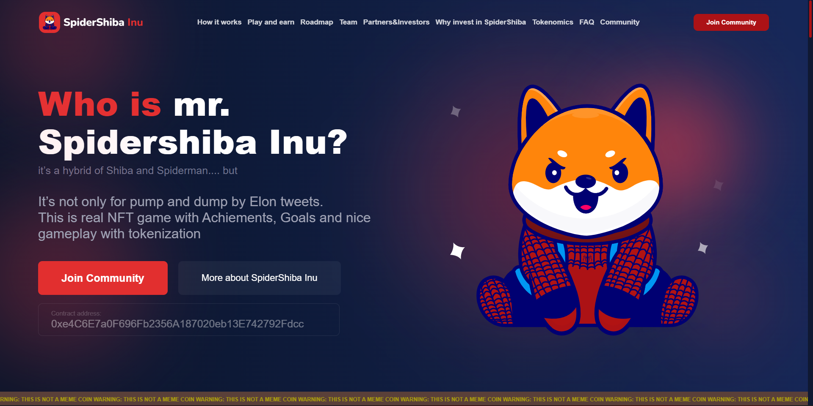

# Лэндинг страницы проекта SpiderShiba

___





____

### Верска выполнена с использование следующих технологий:

* Gulp
* SCSS
* SlickSliders
* FontAwesome 5


___

### Дополнительно

* Реализованы эффекты на странице
* Добавлен адаптив страницы


[Макет лэндинга](https://www.figma.com/file/KcgLz3n0fW4LANqVmEV2Vq/SpiderShiba-Inu-Landing-(Copy)-(Copy))

[Готовый вариант](https://spidershiba.netlify.app/)

___

``` gulp serve ```  -  запустить проект для разработки

``` gulp build ```  -  запустить проект для сборки

``` gulp clear ```  -  очистить папку сборки